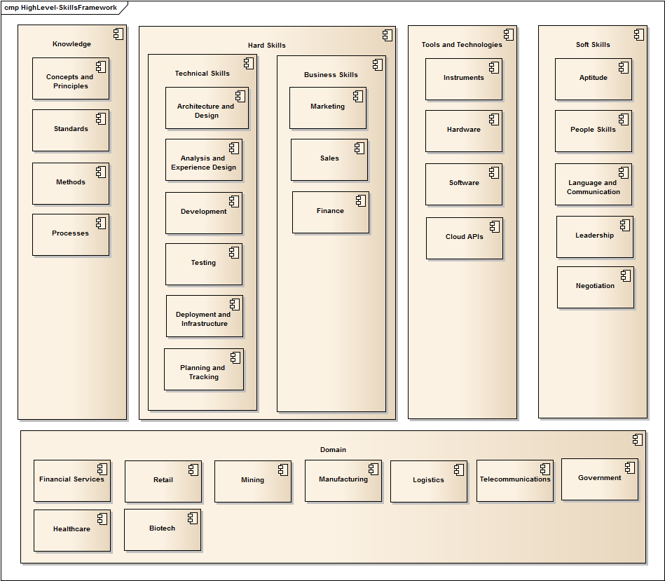

.. _dsd_skills_framework:

DSD Skills Framework
====================

The diagram below provides a high level depiction of the DevSkillDojo Skills Framework. The intention of this framework is to provide
a considered method for strcuturing skills. Additionally, the framework serves as a guideline to prevent one-dimentional thinking
w.r.t skills, i.e. always equating skills with technologies.

Key Point for understanding the purpose of the framework: Projects and product are delivered by people with capabilities.
The dictionary definition is roughly: The ability to do <something>

But it is important to give more structure to this definition, so we use the following pattern:

A CAPABILITY is generally:
 * The application of one or more HARD SKILLS,
 * Guided by pre-existing underlying KNOWLEDGE
 * Using one or more TOOLS or TECHNOLOGIES
 * By a person with a set of SOFT SKILLS

Further detail of the framework is provided in the metamodel and skills ontology (documented separately)

